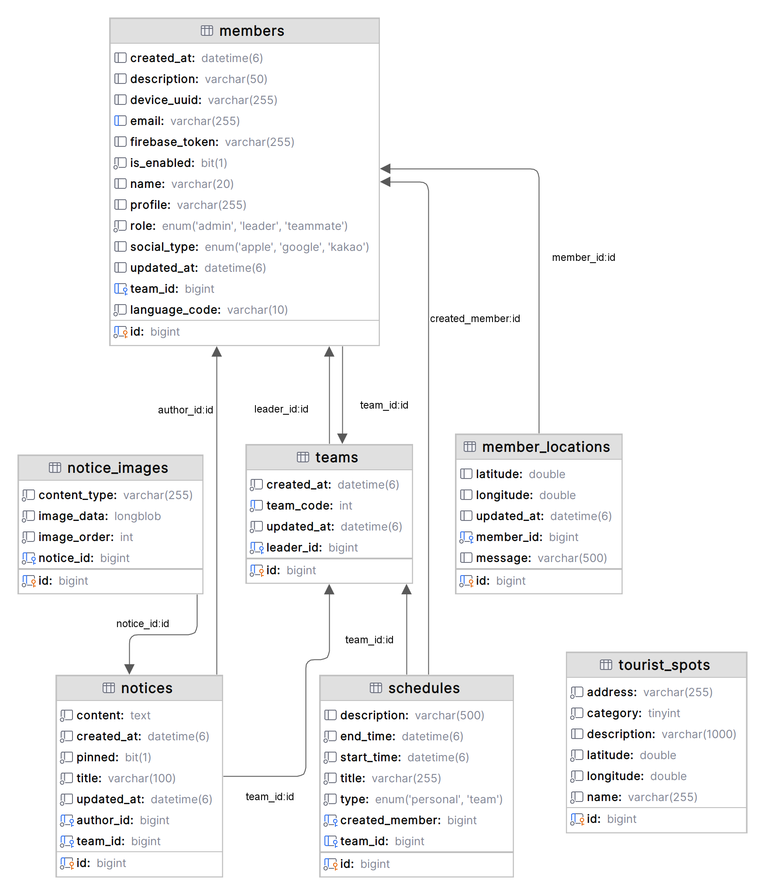

# With-u
### DIVE 2024_다이빙갈매기
#### 이 프로젝트는 부산광역시 공공데이터 활용 해커톤 [DIVE2024](https://www.dxchallenge.co.kr/about-1)에서 삼정KPMG의 발제를 받아 진행했습니다.

## 프로젝트 소개
With-u는 WYD2027 행사를 위한 팀 관리 애플리케이션으로, 참가자들에게 더 나은 경험을 제공하고 행사 운영을 효율적으로 지원합니다.

## 주요 기능

1. **구성원 관리**
    - 팀별 구성원 관리 및 조직화

2. **공지사항 알림 시스템**
     - FCM(Firebase Cloud Messaging)을 이용한 푸시 알림 기능
     - 중요 공지사항 실시간 전달

3. **관광지도 서비스**
     - 부산시 공공데이터를 활용한 주변 관광지 정보 제공

4. **실시간 인원 확인**
     - 블루투스 기술을 활용한 근거리 팀원 출석 확인 시스템

5. **실시간 위치 정보 공유**
    - Naver Map API, Google Geocoding API 를 활용한 위치 실시간 공유
    - 팀장 위치 추적 기능

6. **행사 일정표 관리**
    - 개인 및 팀별 맞춤 일정 관리 기능
    - 일정 변경 시 실시간 업데이트 및 알림

7. **다국어 번역 서비스**
    - Google Cloud Translation API를 활용한 실시간 다국어 번역 기능
    - 다국적 참가자들의 원활한 의사소통 지원

8. **사용자 경험(UX) 최적화**
    - 직관적이고 사용하기 쉬운 인터페이스 설계
    - 사용자 피드백을 반영한 지속적인 기능 개선

## 기술 스택
- **Design**: Figma, Adobe Illustrator, Adobe Photoshop
- **Frontend**: Flutter, Kotlin, Swift, Android Studio
- **Backend**: Spring Boot, Azure Database for MySQL, Intellij
- **Deploy**: AWS, Docker

## 사용된 API 및 서비스
- Naver Map API
- Google Geocoding API
- Google Cloud Translation API
- Firebase Cloud Messaging (FCM)

## 프로젝트 구조

### ERD (Entity Relationship Diagram)

### API 명세서
API의 상세한 사용법과 엔드포인트에 대한 정보는 아래 링크에서 확인할 수 있습니다:
[API 명세서](https://documenter.getpostman.com/view/34763300/2sAXqzWdvG#intro)

## 팀원 소개

  <table>
    <tr>
      <td align="center" width="33%">
         
        <a href="https://github.com/J-1ac">이상준</a> 
        BE
      </td>
      <td align="center" width="33%">
         
        <a href="https://github.com/JackAhn">안도현</a> 
        FE
      </td>
      <td align="center" width="33%">
         
        <a href="https://github.com/LeeJuAe124">이주애</a> 
        Design
      </td>
    </tr>
  </table>

---

## 포트폴리오

프로젝트 발표 자료 및 상세 정보:

발표 자료 펼치기

## 라이센스
이 프로젝트는 MIT 라이센스 하에 있습니다. 자세한 내용은 [LICENSE](LICENSE) 파일을 참조하세요.